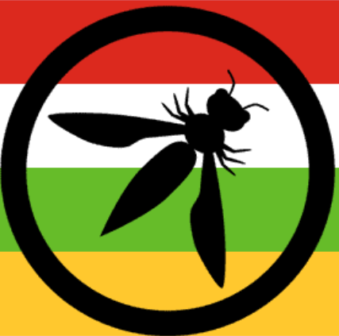

---

layout: col-sidebar
title: OWASP Logrono, La Rioja
site_side: true
tags: logrono
level: 3
region: Europe
country: Spain
meetup-group:

---

<td>
    
</td>

This is the injformation about Logroño, La Rioja Chapter, in this abstract you will find the information about the meeting, social media and others:

<ul>

<li>OWASP Logroño, La Rioja chapter is one of the chapter which has the purpose of being a cybersecurity hub, between wines and good stories to make the best wine and the best hacking</li>

<li>This is a space-delimited list of tags you associate with your project or chapter.  If you are using tabs, at least one of these tags should be unique in order to be used in the tabs files (an example tab is included in this repo) </li>

<li>La Rioja</li>

<li>meetup-group: This is the name of your meetup group, usually in the form of OWASP-chapter.  By putting these details here, the section below labeled 'Next Meeting/Event' will get automatically populated with your upcoming meetup events.</li>
</ul>

## Welcome
Our chapter is the newest of OWASP, but we are looking to actively contribute to each of our meetings and actions aimed at putting the issue of cybersecurity as an integral part of today's world and giving the importance of the constant mutual cooperation that each of the members of our chapter must have. 

## Participation
The Open Worldwide Application Security Project (OWASP) is a nonprofit foundation that works to improve the security of software. All of our projects, tools, documents, forums, and chapters are free and open to anyone interested in improving application security. 

Chapters are led by local leaders in accordance with the [Chapters Policy](/www-policy/operational/chapters). Financial contributions should only be made online using the authorized online donation button. 

Everyone is welcome and encouraged to participate in our [Projects](/projects/), [Local Chapters](/chapters/), [Events](/events/), [Online Groups](https://groups.google.com/a/owasp.com/){:target='_blank'}, and [Community Slack Channel](https://owasp.slack.com/){:target='_blank'}. We especially encourage diversity in all our initiatives. OWASP is a fantastic place to learn about application security, to network, and even to build your reputation as an expert. We also encourage you to be [become a member](/membership/) or consider a [donation](/donate/) to support our ongoing work.

## Next Meeting/Event
---------------------



