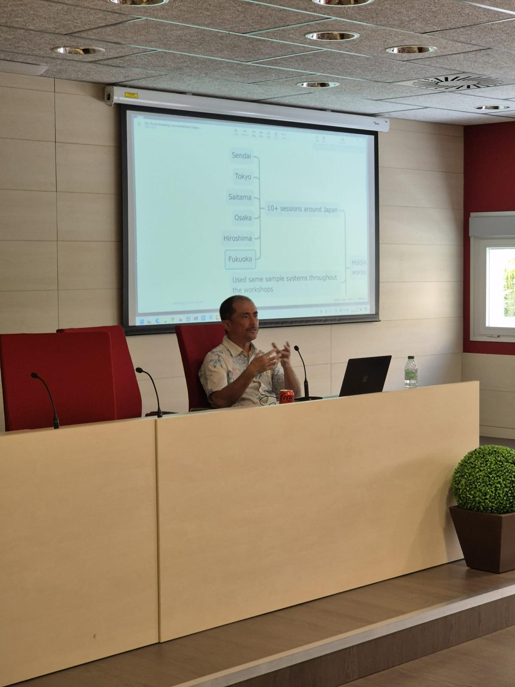
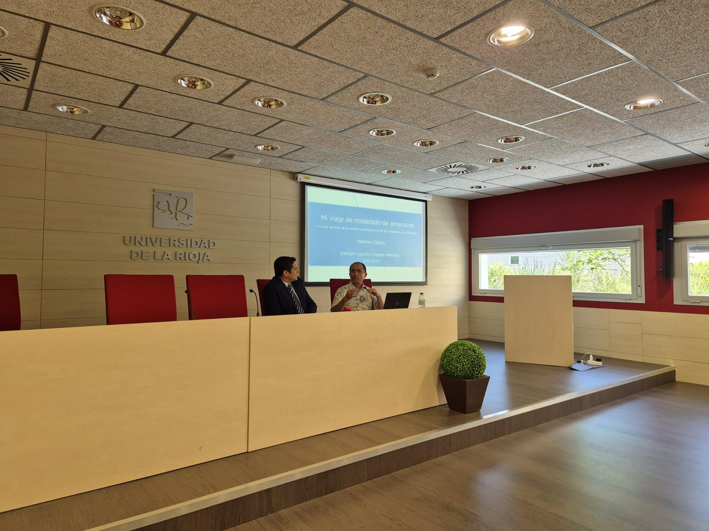
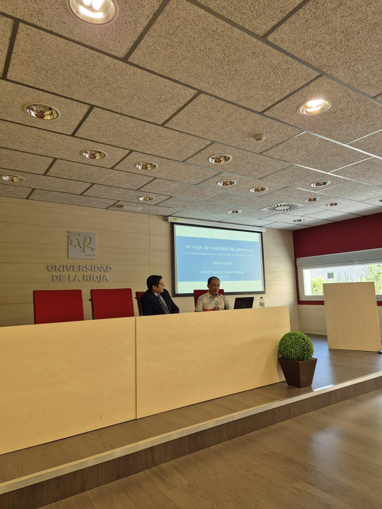

## Past Events

#### Thursday, 25th July 2024 04:00pm (in-person)

Our last event in Logroño was an amazing opportunity to explain about threat modeling.

In this time we have the participation as speaker Takaharu Ogaza, OWASP Sendai leader you can see the event pictures in here.

<td>
    
</td>

<td>
    
</td>

<td>
    
</td>

<td>
    
</td>

<td>
    
</td>

#### Friday, 9th Febrary 2024 10:00am (in-person)

Our last event in Logroño was an amazing opportunity to explain what OWASP means, the different participant share the field knowledge and we have a great moment.

In this time we have the participation as speaker Leocadio Marrero, David Reyes, Spyros, Oscar Orellana and Grant Onger, you can see the event pictures in here.

Soon we are shearing the videos of the event.

<td>
    
</td>

<td>
    
</td>

<td>
    
</td>

<td>
    
</td>

<td>
    
</td>

<td>
    
</td>

<td>
    
</td>
